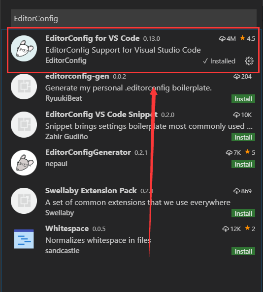
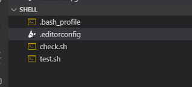
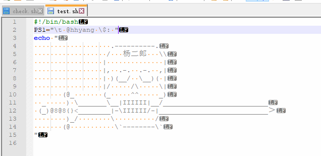

# 1.11. 执行Shell脚本（多种方法）

上节我们编写了一个简单的 Shell 脚本，这节我们就让它运行起来。运行 Shell 脚本有两种方法，一种在新进程中运行，一种是在当前 Shell 进程中运行。

## 在新进程中运行 Shell 脚本
在新进程中运行 Shell 脚本有多种方法。
#### 1) 将 Shell 脚本作为程序运行
Shell 脚本也是一种解释执行的程序，可以在终端直接调用（需要使用 chmod 命令给 Shell 脚本加上执行权限），如下所示：
```ruby {.line-numbers}
ubuntu@VM-0-3-ubuntu:~/bin$ cd demo                #切换到 test.sh 所在的目录
ubuntu@VM-0-3-ubuntu:~/bin$ chmod +x ./test.sh  #给脚本添加执行权限
ubuntu@VM-0-3-ubuntu:~/bin$ ./test.sh           #执行脚本文件
Hello World !                                  #运行结果
```
第 2 行中，`chmod +x`表示给test.sh增加执行权限。

第 3 行中，`./`表示当前目录，整条命令的意思是执行当前目录下的test.sh脚本。如果不写`./`，Linux 会到系统路径（由 PATH 环境变量指定）下查找test.sh而系统路径下显然不存在这个脚本，所以会执行失败。

通过这种方式运行脚本，脚本文件第一行的`#!/bin/bash`一定要写对，好让系统查找到正确的解释器。

#### 2) 将 Shell 脚本作为参数传递给 Bash 解释器
你也可以直接运行 Bash 解释器，将脚本文件的名字作为参数传递给 Bash，如下所示：
```ruby {.line-numbers}
ubuntu@VM-0-3-ubuntu:~/bin$/bin/bash ./test.sh 
Hello World ! 
```
通过这种方式运行脚本，不需要在脚本文件的第一行指定解释器信息，写了也没用。
更加简洁的写法是运行 bash 命令。bash 是一个外部命令，Shell 会在 /bin 目录中找到对应的应用程序，也即 /bin/bash，这点我们已在《[Shell命令的本质到底是什么](./shell6.md)》一节中提到。
```ruby {.line-numbers}
ubuntu@VM-0-3-ubuntu:~/bin$bash ./test.sh
Hello World !
```
这两种写法在本质上是一样的：第一种写法给出了绝对路径，会直接运行 Bash 解释器；第二种写法通过 bash 命令找到 Bash 解释器所在的目录，然后再运行，只不过多了一个查找的过程而已。

#### 检测是否开启了新进程

有些读者可能会疑问，你怎么知道开启了新进程？你有什么证据吗？既然如此，那我就来给大家验证一下吧。

Linux 中的每一个进程都有一个唯一的 ID，称为 PID，使用`$$`变量就可以获取当前进程的 PID。$$是 Shell 中的特殊变量，稍后我会在《Shell特殊变量》一节中展开讲解，读者在此不必深究。

首先编写如下的脚本文件，并命名为 `check.sh`：
```ruby {.line-numbers}
#!/bin/bash
echo $$  #输出当前进程PID
```
然后使用以上两种方式来运行 `check.sh`：
```ruby {.line-numbers}
ubuntu@VM-0-3-ubuntu:~/bin$echo $$
28407 #当前进程的PID
ubuntu@VM-0-3-ubuntu:~/bin$. ./check.sh 
28407 #新进程的PID
ubuntu@VM-0-3-ubuntu:~/bin$echo $$
28407   #当前进程的PID
ubuntu@VM-0-3-ubuntu:~/bin$/bin/bash ./check.sh 
30600 #新进程的PID
ubuntu@VM-0-3-ubuntu:~/bin$bash ./check.sh 
30613   #新进程的PID
ubuntu@VM-0-3-ubuntu:~/bin$
```
你看，进程的 PID 都不一样，当然就是两个进程了。

## 在当前进程中运行 Shell 脚本
这里需要引入一个新的命令——source 命令。source 是 Shell 内置命令的一种，它会读取脚本文件中的代码，并依次执行所有语句。你也可以理解为，source 命令会强制执行脚本文件中的全部命令，而忽略脚本文件的权限。

source 命令的用法为：
```ruby {.line-numbers}
source filename
```
也可以简写为：
```ruby {.line-numbers}
. filename
```
两种写法的效果相同。对于第二种写法，注意点号`.`和文件名中间有一个空格。

例如，使用 source 运行上节的 `check.sh`：
```ruby {.line-numbers}
ubuntu@VM-0-3-ubuntu:~/bin$source ./check.sh 
28407
ubuntu@VM-0-3-ubuntu:~/bin$source check.sh 
28407
ubuntu@VM-0-3-ubuntu:~/bin$. ./check.sh 
28407
ubuntu@VM-0-3-ubuntu:~/bin$. check.sh 
28407
ubuntu@VM-0-3-ubuntu:~/bin$
```
你看，使用 source 命令不用给脚本增加执行权限，并且写不写`./`都行，是不是很方便呢？

## 检测是否在当前 Shell 进程中

我们仍然借助`$$`变量来输出进程的 PID，如下所示：
```ruby {.line-numbers}
ubuntu@VM-0-3-ubuntu:~/bin$echo $$
28407
ubuntu@VM-0-3-ubuntu:~/bin$. check.sh 
28407
ubuntu@VM-0-3-ubuntu:~/bin$source check.sh 
28407
ubuntu@VM-0-3-ubuntu:~/bin$. ./check.sh 
28407
ubuntu@VM-0-3-ubuntu:~/bin$
```
你看，进程的 PID 都是一样的，当然是同一个进程了。

## 总结
作为初学者，你可能看不懂这些运行方式有什么区别，没关系，暂时先留个疑问吧，后续教程中我们会逐一讲解。

如果需要在新进程中运行 Shell 脚本，我一般使用`bash test.sh`这种写法；如果在当前进程中运行 Shell 脚本，我一般使用`. ./test.sh`这种写法。这是我个人的风格。

## 注意
如果通过本地编写的sh脚本往服务器上运行，注意回车。window下默认为`/r/n`,服务器上为`/n`
vscode示例：
1. 安装 EditorConfig 插件
<div align=center>
    
</div>
2. 在当前项目下新建.editorconfig文件 [详细介绍](https://github.com/editorconfig/editorconfig-vscode)
<div align=center>
    
</div>
3. 编写.editorconfig文件
```ruby {.line-numbers}
#.editorconfig 文件

root = true

[*]
# end_of_line = crlf
end_of_line = lf
insert_final_newline = true
```
4. 验证文件是否正确。使用notepad++,，查看所有字符就可以看到了 CRLF。表示`\r\n`,如果仅仅是LF表示`\n`。 设置步骤notepad++,视图，显示符号，显示所有符号。

<div align=center>
    
</div>