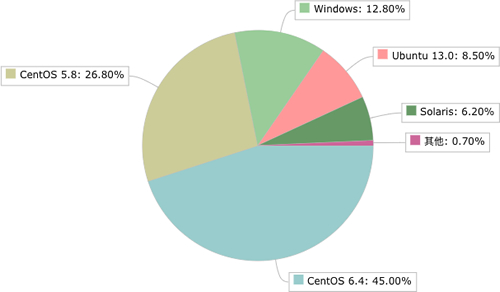

# 1.2. Shell是运维人员必须掌握的技能

Linux 运维人员就是负责 Linux 服务器的运行和维护。随着互联网的爆发，Linux 运维在最近几年也迎来了春天，出现了大量的职位需求，催生了一批 Linux 运维培训班。

如今的 IT 服务器领域是 Linux、UNIX、Windows 三分天下，Linux 系统可谓后起之秀，特别是“互联网热”以来，Linux 在服务器端的市场份额不断扩大，每年增长势头迅猛，开始对 Windows 和 UNIX 的地位构成严重威胁。

下图是 2016 年初国内服务器端各个操作系统的市场份额：

    

可以看出来，Linux 占 80% 左右（包括 CentOS、Ubuntu 等），Windows 占 12.8%，Solaris 占 6.2%。在未来的服务器领域，Linux 是大势所趋。

Linux 在服务器上的应用非常广泛，可以用来搭建 Web 服务器、数据库服务器、负载均衡服务器（CDN）、邮件服务器、DNS 服务器、反向代理服务器、VPN 服务器、路由器等。用 Linux 作为服务器系统不但非常高效和稳定，还不用担心版权问题，不用付费。

正是由于 Linux 服务器的大规模应用，才需要一批专业的人才去管理，这群人就是 **Linux 运维工程师（OPS）**。

OPS 的主要工作就是搭建起运行环境，让程序员写的代码能够高效、稳定、安全地在服务器上运行，他们属于后勤部门。OPS 的要求并不比程序员低，优秀的 OPS 拥有架设服务器集群的能力，还会编程开发常用的工具。

OPS 这项工作的细节内容包括：
* 安装操作系统，例如 CentOS、Ubuntu 等。
* 部署代码运行环境，例如网站后台语言采用 PHP，就需要安装 Nginx、Apache、MySQL、PHP 运行时等。
* 及时修复漏洞，防止服务器被攻击，这包括 Linux 本身漏洞以及各个软件的漏洞。
* 根据项目需求升级软件，例如 PHP 7.0 在性能方面获得了重大突破，如果现在服务器压力比较大，就可以考虑将旧版的 PHP 5.x 升级到 PHP 7.0。
* 监控服务器压力，别让服务器宕机。例如淘宝双十一的时候就会瞬间涌入大量用户，导致部分服务器宕机，网页没法访问，甚至连支付宝都不能使用。
* 分析日志，及时发现代码或者环境的问题，通知相关人员修复。

这些任务只要登录远程服务器，或者去机房连接服务器（下图所示）就能够完成，为什么要用 Shell 编程呢？

    

因为 OPS 面对的是成千上万台的服务器，不是十台八台，你总不能把同样的工作重复成千上万遍吧，那时估计黄花菜都凉了，市场也成一片红海了。

服务器一旦多了，这些人力工作都需要自动化起来，跑一段代码就能在成千上万台服务器上完成相同的工作，例如服务的监控、代码快速部署、服务启动停止、数据备份、日志分析等。

Shell 脚本很适合处理纯文本类型的数据，而 Linux 中几乎所有的配置文件、日志文件（如 NFS、Rsync、Httpd、Nginx、MySQL 等），以及绝大多数的启动文件都是纯文本类型的文件。

Shell 脚本是实现 Linux 系统自动管理以及自动化运维所必备的工具，Linux 的底层以及基础应用软件的核心大都涉及 Shell 脚本的内容。每一个合格的 Linux 系统管理员或运维工程师，都应该能够熟练的编写 Shell 脚本，只要这样才能提升运维人员的工作效率，减少不必要的重复劳动，为个人的职场发展奠定较好的基础。

## Shell、Python 和 Perl

除了 Shell，能够用于 Linux 运维的脚本语言还有 Python 和 Perl。

#### 1) Perl 语言
Perl 比 Shell 强大很多，在 2010 年以前很流行，它的语法灵活、复杂，在实现不同的功能时可以用多种不同的方式，缺点是不易读，团队协作困难。

Perl 脚本已经成为历史了，现在的 Linux 运维人员几乎不需要了解 Perl 了，最多可以了解一下 Perl 的安装环境。

#### 2) Python 语言
Python 是近几年非常流行的语言，它不但可以用于脚本程序开发，也可以实现 Web 程序开发（知乎、豆瓣、YouTube、Instagram 都是用 Python 开发），甚至还可以实现软件的开发（大名鼎鼎的 OpenStack、SaltStack 都是 Python 语言开发）、游戏开发、大数据开发、移动端开发。

现在越来越多的公司要求运维人员会 Python 自动化开发，Python 也成了运维人员必备的技能，每一个运维人员在熟悉了 Shell 之后，都应该再学习 Python 语言。

#### 3) Shell
Shell 脚本的优势在于处理偏操作系统底层的业务，例如，Linux 内部的很多应用（有的是应用的一部分）都是使用 Shell 脚本开发的，因为有 1000 多个 Linux 系统命令为它作支撑，特别是 Linux 正则表达式以及三剑客 grep、awk、sed 等命令。

对于一些常见的系统脚本，使用 Shell 开发会更简单、更快速，例如，让软件一键自动化安装、优化，监控报警脚本，软件启动脚本，日志分析脚本等，虽然 Python 也能做到这些，但是考虑到掌握难度、开发效率、开发习惯等因素，它们可能就不如 Shell 脚本流行以及有优势了。对于一些常见的业务应用，使用 Shell 更符合 Linux 运维简单、易用、高效的三大原则。

Python 语言的优势在于开发复杂的运维软件、Web 页面的管理工具和 Web 业务的开发（例如 CMDB 自动化运维平台、跳板机、批量管理软件 SaltStack、云计算 OpenStack 软件）等。

我们在开发一个应用时，应该根据业务需求，结合不同语言的优势以及自己擅长的语言来选择，扬长避短，从而达到高效开发、易于自己维护的目的。