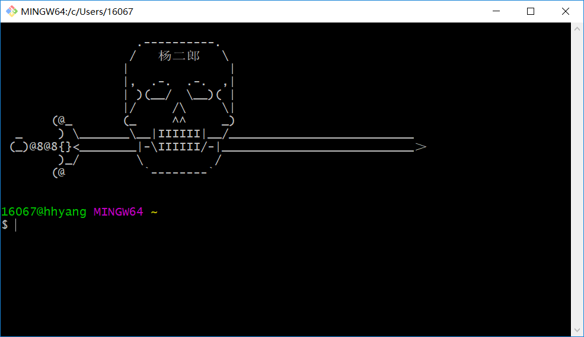

# 1.4. 进入Shell的两种方式

在 Linux 发展的早期，唯一能用的工具就是 Shell，Linux 用户都是在 Shell 中输入文本命令，并查看文本输出；如果有必要的话，Shell 也能显示一些基本的图形。

而如今 Linux 的环境已经完全不同，几乎所有的 Linux 发行版都使用某种图形桌面环境（例如 GNOME、KDE、Unity 等），这使得原生的 Shell 入口被隐藏了，进入 Shell 仿佛变得困难起来。

## 进入 Linux 控制台

一种进入 Shell 的方法是让 Linux 系统退出图形界面模式，进入控制台模式，这样一来，显示器上只有一个简单的带着白色文字的“黑屏”，就像图形界面出现之前的样子。这种模式称为 Linux 控制台（Console）。

现代 Linux 系统在启动时会自动创建几个虚拟控制台（Virtual Console），其中一个供图形桌面程序使用，其他的保留原生控制台的样子。虚拟控制台其实就是 Linux 系统内存中运行的虚拟终端（Virtual Terminal）。

从图形界面模式进入控制台模式也很简单，往往按下 `Ctrl + Alt + Fn(n=1,2,3,4,5...)` 快捷键就能够来回切换。

例如，CentOS 在启动时会创建 6 个虚拟控制台，按下快捷键 `Ctrl + Alt + Fn(n=2,3,4,5,6)` 可以从图形界面模式切换到控制台模式，按下 `Ctrl + Alt + F1` 可以从控制台模式再切换回图形界面模式。也就是说，1 号控制台被图形桌面程序占用了。

> 在图形界面模式下，输入密码时往往会显示为 *，密码有几个字符就显示几个 *；而在控制台模式下，输入密码什么都不会显示，好像按键无效一样，这一点请大家不要惊慌，只要输入的密码正确就能够登录。

图形界面也是一个程序，会占用 CPU 时间和内存空间，当 Linux 作为服务器系统时，安装调试完毕后，应该让 Linux 运行在控制台模式下，以节省服务器资源。正是由于这个原因，很多服务器甚至不安装图形界面程序，管理员只能使用命令来完成各项操作

## 使用终端

进入 Shell 的另外一种方法是使用 Linux 桌面环境中的终端模拟包（Terminal emulation package），也就是我们常说的终端（Terminal），这样在图形桌面中就可以使用 Shell。

打开终端后，就可以输入 Shell 命令了 **此为windows 下git bash 示例** ：

    

CentOS 默认的图形界面程序是 GNOME，该终端模拟包也是 GNOME 自带的。

除了 GNOME 终端，Linux 还有其他的终端模拟包，例如：
* **xterm 终端**
最古老最基础的 X Windows 桌面程序自带的终端模拟包就是 xterm。xterm 在 X Windows 出现之前便已经存在了，默认包含在大多数 X Windows 中。xterm 虽然没有太多炫目的特性，但是运行它不需要太多的资源，所以 xterm 在针对老硬件设计的 Linux 发行版中仍然很常见，比如 fluxbox 图形桌面环境就用它作为默认的终端模拟包。
* **Konsole 终端**
KDE 桌面项目也开发了自己的终端模拟包，名为 Konsole。Konsole 整合了基本的 xterm 特性以及一些更高级的类似 Windows 应用程序的特性。
