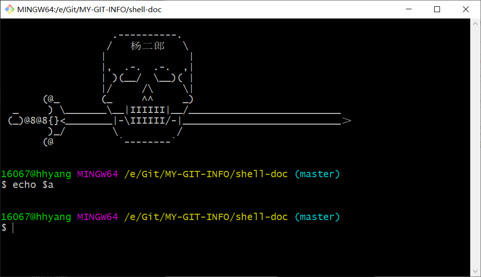

# 2.2. Shell变量的作用域（精讲）

Shell 变量的作用域（Scope），就是 Shell 变量的有效范围（可以使用的范围）。

在不同的作用域中，同名的变量不会相互干涉，就好像 A 班有个叫小明的同学，B 班也有个叫小明的同学，虽然他们都叫小明（对应于变量名），但是由于所在的班级（对应于作用域）不同，所以不会造成混乱。但是如果同一个班级中有两个叫小明的同学，就必须用类似于“大小明”、“小小明”这样的命名来区分他们。

Shell 变量的作用域可以分为三种：
* 有的变量只能在函数内部使用，这叫做**局部变量（local variable）**；
* 有的变量可以在当前 Shell 进程中使用，这叫做**全局变量（global variable）**；
* 而有的变量还可以在子进程中使用，这叫做**环境变量（environment variable）**。

## Shell 局部变量

Shell 也支持自定义函数，但是 Shell 函数和 C++、Java、C# 等其他编程语言函数的一个不同点就是：在 Shell 函数中定义的变量默认也是**全局变量**，它和在函数外部定义变量拥有一样的效果。请看下面的代码：

```ruby

#!/bin/bash
#定义函数
function func(){
    a=99
}
#调用函数
func
#输出函数内部的变量
echo $a
```

输出结果：
99

a 是在函数内部定义的，但是在函数外部也可以得到它的值，证明它的作用域是全局的，而不是仅限于函数内部。

要想变量的作用域仅限于函数内部，可以在定义时加上`local`命令，此时该变量就成了局部变量。请看下面的代码：

```ruby

#!/bin/bash
#定义函数
function func(){
    local a=99
}
#调用函数
func
#输出函数内部的变量
echo $a
```

输出结果为空，表明变量 a 在函数外部无效，是一个局部变量。

Shell 变量的这个特性和 JavaScript 中的变量是类似的。在 JavaScript 函数内部定义的变量，默认也是全局变量，只有加上`let`关键字，它才会变成局部变量。

本节只是演示了函数的定义和调用，并没有对语法细节作过多说明，后续我们将在《Shell函数》一节中进行深入讲解。

## Shell 全局变量
所谓全局变量，就是指变量在当前的整个 Shell 进程中都有效。每个 Shell 进程都有自己的作用域，彼此之间互不影响。**在 Shell 中定义的变量，默认就是全局变量**。

想要实际演示全局变量在不同 Shell 进程中的互不相关性，可在图形界面下同时打开两个 Shell。

首先打开一个 Shell 窗口，定义一个变量 a 并赋值为 99，然后打印，这时在同一个 Shell 窗口中是可正确打印变量 a 的值的。然后再打开一个新的 Shell 窗口，同样打印变量 a 的值，但结果却为空，如图 1 所示。

<div align=center>
    
    
</div>

这说明全局变量 a 仅仅在定义它的第一个 Shell 进程中有效，对新的 Shell 进程没有影响。这很好理解，就像小王家和小徐家都有一部电视机（变量名相同），但是同一时刻小王家和小徐家的电视中播放的节目可以是不同的（变量值不同）。

需要强调的是，全局变量的作用范围是当前的 Shell 进程，而不是当前的 Shell 脚本文件，它们是不同的概念。打开一个 Shell 窗口就创建了一个 Shell 进程，打开多个 Shell 窗口就创建了多个 Shell 进程，每个 Shell 进程都是独立的，拥有不同的进程 ID。在一个 Shell 进程中可以使用 source 命令执行多个 Shell 脚本文件，此时全局变量在这些脚本文件中都有效。

例如，现在有两个 Shell 脚本文件，分别是 a.sh 和 b.sh。a.sh 的代码如下：

```ruby

#!/bin/bash
echo $a
b=200
```

b.sh的代码如下：

```ruby
#!/bin/bash
echo $b
```

打开一个 Shell 窗口，输入以下命令：

```ruby
16067@hhyang MINGW64 /e/codeTest/test_shell
$ a=99

16067@hhyang MINGW64 /e/codeTest/test_shell
$ . a.sh
99

16067@hhyang MINGW64 /e/codeTest/test_shell
$ . b.sh
200

16067@hhyang MINGW64 /e/codeTest/test_shell
$
```

这三条命令都是在一个进程中执行的，从输出结果可以发现，在 Shell 窗口中以命令行的形式定义的变量 a，在 a.sh 中有效；在 a.sh 中定义的变量 b，在 b.sh 中也有效，变量 b 的作用范围已经超越了 a.sh。

注意，必须在当前进程中运行 Shell 脚本，不能在新进程中运行 Shell 脚本，不了解的读者请转到《[执行Shell脚本](../base/shell11.md)》。

## Shell 环境变量

全局变量只在当前 Shell 进程中有效，对其它 Shell 进程和子进程都无效。如果使用`export`命令将全局变量导出，那么它就在所有的子进程中也有效了，这称为“环境变量”。

环境变量被创建时所处的 Shell 进程称为父进程，如果在父进程中再创建一个新的进程来执行 Shell 命令，那么这个新的进程被称作 Shell 子进程。当 Shell 子进程产生时，它会继承父进程的环境变量为自己所用，所以说环境变量可从父进程传给子进程。不难理解，环境变量还可以传递给孙进程。

注意，两个没有父子关系的 Shell 进程是不能传递环境变量的，并且环境变量只能向下传递而不能向上传递，即“传子不传父”。

创建 Shell 子进程最简单的方式是运行 bash 命令，如图 2 所示。

<div align=center>
    
</div>

通过`exit`命令可以一层一层地退出 Shell。

下面演示一下环境变量的使用：

```ruby
16067@hhyang MINGW64 /e/codeTest/test_shell
$ a=22      #定义一个全局变量

16067@hhyang MINGW64 /e/codeTest/test_shell
$ echo $a    #在当前Shell中输出a，成功
22

16067@hhyang MINGW64 /e/codeTest/test_shell
$ bash  #进入Shell子进程

16067@hhyang MINGW64 /e/codeTest/test_shell
$ echo $a   #在子进程中输出a，失败


16067@hhyang MINGW64 /e/codeTest/test_shell
$ exit   #退出Shell子进程，返回上一级Shell
exit

16067@hhyang MINGW64 /e/codeTest/test_shell
$ export a  #将a导出为环境变量

16067@hhyang MINGW64 /e/codeTest/test_shell
$ bash  #重新进入Shell子进程

16067@hhyang MINGW64 /e/codeTest/test_shell
$ echo $a   #在子进程中再次输出a，成功
22

16067@hhyang MINGW64 /e/codeTest/test_shell
$ exit  #退出Shell子进程
exit

16067@hhyang MINGW64 /e/codeTest/test_shell
$ exit  #退出父进程，结束整个Shell会话
```

可以发现，默认情况下，a 在 Shell 子进程中是无效的；使用 export 将 a 导出为环境变量后，在子进程中就可以使用了。

`export a`这种形式是在定义变量 a 以后再将它导出为环境变量，如果想在定义的同时导出为环境变量，可以写作`export a=22`。

我们一直强调的是环境变量在 Shell 子进程中有效，并没有说它在所有的 Shell 进程中都有效；如果你通过终端创建了一个新的 Shell 窗口，那它就不是当前 Shell 的子进程，环境变量对这个新的 Shell 进程仍然是无效的。

## 环境变量也是临时的
通过 export 导出的环境变量只对当前 Shell 进程以及所有的子进程有效，如果最顶层的父进程被关闭了，那么环境变量也就随之消失了，其它的进程也就无法使用了，所以说环境变量也是临时的。

读者可能会问，如果我想让一个变量在所有 Shell 进程中都有效，不管它们之间是否存在父子关系，该怎么办呢？

只有将变量写入 Shell 配置文件中才能达到这个目的！Shell 进程每次启动时都会执行配置文件中的代码做一些初始化工作，如果将变量放在配置文件中，那么每次启动进程都会定义这个变量。不知道如何修改配置文件的读者请猛击《[Shell配置文件的加载](../base/shell13.md)》《[编写自己的Shell配置文件](../base/shell114.md)》。